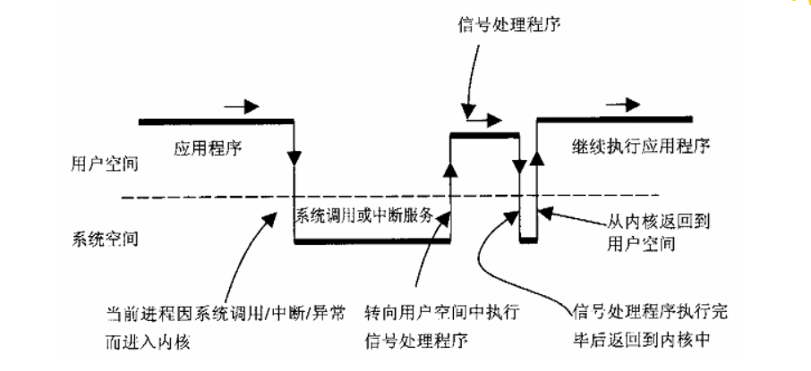

[toc]

#### Linux  Signal 一网打尽

##### 前言

Linux Signal想毕很多人都用过，比如在命令行下想要结束某个进程，我们会使用`kill pid`或者`kill -9 pid`，其实就是通过给对应的进程发送信号来完成。

 Linux signal 实际上可以看作是一种进程间通讯的异步方式，进程通过对接收到的信号作相应的系统默认处理或者用户自定义处理来实现某种功能，这听起来，信号处理在行为上与中断有几分相似。

下面我们就来进入到Linux Signal的世界吧~~~

#####  信号的使用

我们先通过一段代码实例来看一下信号量的使用吧。

``` c
void IntHandler(int signum) {
  std::cout << time(NULL) << " Got a int signal" << signum << std::endl;
  std::this_thread::sleep_for(5s);
  std::cout << time(NULL) << " Fininsh int signal" << signum << std::endl;
}

int main(int argc, char* argv[]) {
  signal(SIGINT, IntHandler);

  while(true) {
    std::this_thread::sleep_for(10s);
    std::cout << "." << std::endl;
  }

  std::cout << std::endl;

  return 0;
}
```

上面这段代码，我们通过`signal(SIGINT, IntHandler);`自定义了`SIGINT`信号量的处理。程序运行起来后，当按下`ctrl + c`时，`IntHandler`信号处理函数被触发。

我们再来看一个例子：

```c
void AlarmHandler(int signum) {
  std::cout << "Got a alarm signal" << std::endl;
}

void TestAlarm() {
  struct sigaction sig;
  sig.sa_handler = AlarmHandler;
  sig.sa_flags = 0;
  sigemptyset(&sig.sa_mask);

  struct sigaction old;
  sigaction(SIGALRM, &sig, &old);
  std::cout << "A SIGALRM handler has registered" << std::endl;

  alarm(3);

  pause();

  std::cout << "Raise another alarm signal, in 2 second later" << std::endl;
  alarm(2);

  std::cout << "Star sleep 10s ..." << std::endl;
  sleep(10);

  std::cout << "Exit sleep 10s ..." << std::endl;
  std::cout << "Exit..." << std::endl;
    
  sigaction(SIGALRM, &old, NULL);
}

int main(int argc, char* argv[]) {
  TestAlarm();

  return 0;
}
```

上面的代码我们首先使用`sigaction(SIGALRM, &sig, &old);`安装了`SIGALRM`的用户自定义处理函数`AlarmHandler`, 然后我们调用`alarm(3)`，设置了一个3s后的闹钟，再调用`pause()`让主程序暂停，2s后闹钟到时，`AlarmHandler`函数被触发，`pause()`调用被中断，主程序继续往下运行。

接下来又设置了一个2s的闹钟后，进入`sleep（10）`的10s睡眠，2s后闹钟到时，`AlarmHandler`函数被触发，` sleep()`调用被中断，主程序继续往下运行。

这里给读者留个小问题，如果把上面代码里的`sleep`换成`std::this_thread::sleep_for(10s);`，会是什么样的结果呢？

##### 信号的发送

信号的发送，有人说那还不简单，只要知道一个进程的pid, 那就发呗~~~

之前写过一篇文章[Linux PID 一网打尽](https://zhuanlan.zhihu.com/p/188269136), 里面介绍了在Linux系统里面，有`进程，线程，线程组，进程组`这几个概念。相应地，信号的发送对象也是多种多样。

*  **raise**: 发送signal到当前的调用进程或线程。如果是单线程程序，就是发送给这个进程，也就是发送到主线程；对于多线程程序，发送给当前调用raise的这个线程；
* **kill** : 发送signal到任意的进程组或进程，它需要一个pid参数。
  1. 如果pid是大于0的，这个signal发送到这个pid相应的进程，一个进程里可能有多个线程，这个signal可以被其中任意一个线程接收并处理（前提是这个线程没有屏蔽掉这个信号）；
  2. 如果pid等于0，这个signal发送到当前调用这个kill的进程所在的进程组里的每一个进程；
  3. 如果pid等于-1，这个signal发送到系统中除了pid=1的进程以外的其他所有当前进程有权发送signal的所有进程；
  4. 如果pid小于-1， 这个signal发送到进程组ID为`-pid`的进程组中的每一个进程。
* **tgkill** ： 可以直接将signal发送到一个线程组里的某一个线程。

##### 信号的同步异步处理

对信号的处理可以分为同步和异步两种方式

* 异步方式，是大家最熟悉也是最常用的，就像我们上面的例子一样，使用`signal`或`sigaction`设置处理信号的handler；
* 同步方式，大家用得少，顾名思义就是在代码里阻塞住，直接有signal到来，然后在这一点kernel将到来的signal的相关信息返回给程序，一般有两种方法：
  1. 调用`sigwaitinfo`, `sigtimedwait`和`sigwait`: 阻塞住代码运行，直接有signal到来; 
  2. `signalfd`: 这完全贯彻了Linux下一切皆文件的方针，通过这个接口你可以将对signal的接收抽象成通过的对这个fd的读取操作，因为已经是fd了，它就是变通的文件的fd没什么异同了，你可以通过read阻塞到来，也可以使用`select`,`epoll`等来多路复用。

##### 信号的状态

*  pending状态：从信号产生到信号到达进程这段时间是处于pending状态，所有的信号都在是系统调用完成返回用户空间前被处理掉，如果当前的进程没有触发任可的系统调用，那到达它的所有信号都不会被处理； 
* blocked状态：可以理解成信号被阻塞，它不能到达当前进程，直到当前进程解除了对此signal的阻塞，那之前已经被阻塞的signal又会到来被处理。进程中的每一个线程都有自己独立的signal mask, 这个signal mask可以被用于设置当前线程要阻塞哪些signal。

##### 信号的分类

 Linux支持POSIX的标准信号和POSIX的real-time实时信号。

###### 标准信号

标谁信号基本上是从Unix继承而来，包含下列表格中的这批信号：


有以下几点需要注意：

1. `SIGKILL`和`SIGSTOP`这两个信号不能被捕获，不能阻塞，也不能被忽略，完全由Linux系统自身来处理；
2. 不支持排队，如果在某个signal被阻塞时，产生了多个这个signal, 那当这个signal变成非阻塞时，只有最先产生的那一个signal会到达并被处理；
3. 发送到进程的多个signal, 它们到达进程并被处理的顺序是不确定的。

###### 实时信号

从Linux2.2版本开始，支持了real-time信号，这些real-time信号量被定义在宏`SIGRTMIN` 和 `SIGRTMAX`之间，Linux系统没有给它们预先定义含义，它们可以被应用程序自由定义。

我们先看个例子：

``` c
void MinPlus2Handler(int signum) {
  std::cout << time(NULL) << " Got a SIGRTMIN + 2 signal" << signum << std::endl;
}

int main(int argc, char* argv[]) {
  signal(SIGRTMIN+2, MinPlus2Handler);

  while(true) {
    std::this_thread::sleep_for(10s);
    std::cout << "." << std::endl;
  }

  std::cout << std::endl;
    
  return 0;
}
```

上面代码我们通过`signal(SIGRTMIN+2, MinPlus2Handler);`为实时信号`SIGRTMIN+2`设置了handler。

在我的Linux系统上`SIGRTMIN+2`是36, 运行上面的程序，然后`kill -36 pid`，则`MinPlus2Handler`会被触发。

实时信号有以下这几个特点：

1. 如果某一个实时信号当前是被阻塞的，那么如果产生了多个这个实时信号，它们会**被排队**，等阻塞被取消后，所有实例均可到达进程并被处理；
2. 可以使用`sigqueue`来发送，同时携带用户自定义数据，这样在用户自定义的handler被回调时，可以获取到这个用户自定义数据。另外，这个 `sigqueue`也可以用于发送上面讲过的标准信号，但是此时针对同一个标准信号，依然不支持排队操作；
3. 实时信号与标谁信号不同，多个实时信号到达的顺序和它们被发送的顺序是一样的。

##### 信号的内核实现

###### 信号的发送

我们最常用的向一个进程发送信号的方法就是`kill`, 它其实对应着一个系统调用也是`kill`,定义在`kernel/signal.c`中：

```c
/**                                                  
 *  sys_kill - send a signal to a process            
 *  @pid: the PID of the process                     
 *  @sig: signal to be sent                          
 */                                                  
SYSCALL_DEFINE2(kill, pid_t, pid, int, sig)          
{                                                    
	struct kernel_siginfo info;                  
	prepare_kill_siginfo(sig, &info);            
	return kill_something_info(sig, &info, pid); 
}                                                    
```

此系统调用需要两个参数，在用户容间看到的进程pid（pid_t在内核代码被定义为int），另一个参数就是要发送的signal mumber。

我们接着看一下`kill_something_info`函数的实现，主要的逻辑都在这里：

1. 先来看`pid > 0`里的处理, 前面我们讲过如果pid是大于0的，这个signal发送到这个pid相应的进程：

```c
if (pid > 0) {                                               
▸       rcu_read_lock();                                     
▸       ret = kill_pid_info(sig, info, find_vpid(pid));      
▸       rcu_read_unlock();                                   
▸       return ret;                                          
}
```

我们来讲下`find_vpid`，在用户态调用`kill`时只需要知道进程的pid, 这个pid就是整数型值。kernel则需要根据这个pid

查找到其对应的`struct pid`, 这就是`find_vpid`所作的事：

```c
find_pid_ns(nr, task_active_pid_ns(current)); 
       |                   |
       |                   |
       |                   V
       |           ns_of_pid(task_pid(current))
       |                |        |
       |                |        |
       |                |        V
       |                |  current->thread_pid (获取到current task的struct pid)
       |                |
       |                |
       |                V
       |           pid->numbers[pid->level].ns （从current task的pid中获取到 pid namespace）          |
       V
  idr_find(&ns->idr, nr) (pid_t在分配时是通过这个pid对应的pid namespace的idr来统一分配，反之查找时也是通过相应pid namespace 的idr)
```

我们再来看一下`kill_pid_info`的实现：

```c
int kill_pid_info(int sig, struct kernel_siginfo *info, struct pid *pid)  {
    ...
        
     rcu_read_lock(); 
     //先根据pid获取到对应的task_struct
     p = pid_task(pid, PIDTYPE_PID);                                   
     if (p)                                                            
     ▸       error = group_send_sig_info(sig, info, p, PIDTYPE_TGID);  
     rcu_read_unlock();                                                
     if (likely(!p || error != -ESRCH))                                
     ▸       return error; 	
} 
```

先根据pid获取到对应的task_struct, 然后调用`group_send_sig_info` -> `do_send_sig_info` -> `send_signal`->`__send_signal`, 我们重点来看一下最后这个函数，我把重点的流程处理提取出来，配上相应的注释：

```c
//先放一个比较重要的struct sigpeding
struct sigpending {             
▸       struct list_head list;  
▸       sigset_t signal;        
};                              

```

```c
static int __send_signal(int sig, struct kernel_siginfo *info, struct task_struct *t, 
	enum pid_type type, bool force)                               
                                     
{                                                                               
        struct sigpending *pending;                                                
        struct sigqueue *q;                                                        
        int override_rlimit;                                                       
        int ret = 0, result;                                                       
        ...
        //先根据type的不同获取到对应的sigpending 
        // 可以是线程组共享队列t->signal->shared_pending, 也可以是task私有队列t->pending
        // 当前应该是PIDTYPE_TGID，信号是发送到当前进程的，也即TGID, 使用task_struct的signal->pending来接收
        pending = (type != PIDTYPE_PID) ? &t->signal->shared_pending : &t->pending;
    
        ...
        result = TRACE_SIGNAL_ALREADY_PENDING;
        //使用legacy_queue来判断如果sig是属于上面介绍过的标谁信号，且已经在pending队列中，则不再添加，
        //这也就是上面说的标准信号不支持排队
        if (legacy_queue(pending, sig))       
            goto ret;                     
        ...
        //对于SIGKILL信号，或者是发送给内核线程的信号，不挂载到pending队列，
        //直接跳转到out_set,优先处理
        if ((sig == SIGKILL) || (t->flags & PF_KTHREAD))   
			goto out_set;                              
        ...
         //分配新的sigqueue结构体
         q = __sigqueue_alloc(sig, t, GFP_ATOMIC, override_rlimit）; 
         if (q) {        
            //添加到上面获取到的pending链接里
			list_add_tail(&q->list, &pending->list); 
         }
       ...
       // 再把sig原子性地添加到pending->signal中
       sigaddset(&pending->signal, sig); 
       ...
       //挑选出合适的task来用于具体处理这个signal, 必要时唤醒这个task
       complete_signal(sig, t, type);
       ...
}
```

我们再来看下 `complete_signal`的实现：

```c
static void complete_signal(int sig, struct task_struct *p, enum pid_type t）
{                                                                          
       struct signal_struct *signal = p->signal;                          
       struct task_struct *t;                                             
                                                                          
       //先判断当前task（主线程）是不可以处理这个signal
       if (wants_signal(sig, p))                                          
              t = p;                                                     
       else if ((type == PIDTYPE_PID) || thread_group_empty(p))           
              如果signal是发送给某个线程或者当前线程组为空，则直接返回 
              return;                                                    
       else {                                                             
              //遍历当前线程组所有线程，找到合适的线程
              t = signal->curr_target;                                   
              while (!wants_signal(sig, t)) {                            
                     t = next_thread(t);                                
                     if (t == signal->curr_target)                                       
                            return;                                    
              }                                                          
              signal->curr_target = t;                                   
       }                                                                  
                                                                          
       ...                                                            
       //唤醒被中的task
       signal_wake_up(t, sig == SIGKILL);                                         
       return;                                                                    
}                                                                                  

```

接下来看一下一个比较重要的函数`signal_wake_up`：

```c
void signal_wake_up_state(struct task_struct *t, unsigned int state)            
{          
      // 设置TIF_SIGPENDING的task的flag,
      // 我们上面说过signal的处理时机是在系统调用完成后从内核态返回用户态时，
      // 此时要检查这个TIF_SIGPENDING是否被设置
      set_tsk_thread_flag(t, TIF_SIGPENDING);                                 
      /*                                                                      
       * TASK_WAKEKILL also means wake it up in the stopped/traced/killable   
       * case. We don't check t->state here because there is a race with it   
       * executing another processor and just now entering stopped state.     
       * By using wake_up_state, we ensure the process will wake up and       
       * handle its death signal.                                             
       */ 
      // 唤醒对应的task, 这部分具体实现我们留到后面讲task调度时再详细说明
      if (!wake_up_state(t, state | TASK_INTERRUPTIBLE))
          kick_process(t);                                                
}                                                                               
```

2. 我们来看一下 `pid = -1`时`kill_something_info`的处理，上面我们讲过此时这个signal发送到系统中除了pid=1的进程以外的其他所有当前进程有权发送signal的所有进程：

   ```c
    int retval = 0, count = 0;                                  
    struct task_struct * p;                                     
                                
    //遍历当前所有process
    for_each_process(p) {                                       
           if (task_pid_vnr(p) > 1 && !same_thread_group(p, current)) {   
                  //发送signal到每个thread group
                  int err = group_send_sig_info(sig, info, p, PIDTYPE_MAX); 
                  ++count;                                    
                  if (err != -EPERM)                          
                  ▸       retval = err;                       
           }                                                   
    }                                                           
    ret = count ? retval : -ESRCH;                              
   ```

   直此，信号的发送流程就介绍完了。

###### 信号的处理

在Linux中， signal被处理的时机是在系统调用完成返回到用户态前作统一处理。

* 我们先来简单回顾下系统调用相关的知识点

  简单来说，传统系统调用使用`int 0x80`中断陷入内核，走的是中断处理的流程，需要作权限验证，内核栈切换，segment的加载等等，速度慢。进入到64位后，CPU提供了新的`syscall`指令使用`MSR`寄存器来加载code segment和系统调用处理入口，这被称名`快速系统调用`，在kernel启动时被初始化（arch/x86/kernel/cpu/common.c）：

  ```c
   void syscall_init(void)                                          
   {                                                                
   ▸       wrmsr(MSR_STAR, 0, (__USER32_CS << 16) | __KERNEL_CS);   
   ▸       wrmsrl(MSR_LSTAR, (unsigned long)entry_SYSCALL_64);      
       
           /* Flags to clear on syscall */                      
          wrmsrl(MSR_SYSCALL_MASK,                             
                 X86_EFLAGS_TF|X86_EFLAGS_DF|X86_EFLAGS_IF|    
                 X86_EFLAGS_IOPL|X86_EFLAGS_AC|X86_EFLAGS_NT); 
  }
  ```

  可以看到当前的系统调用处理入口是`entry_SYSCALL_64`，这是段汇编，位于`arch/x86/entry/entry_64.S`中，我们简单过下这段汇编：

  ```c
  ENTRY(entry_SYSCALL_64) 
     //交换用户态和内核态gs寄存器，
     //交换内核栈和用户态栈，
     //交换CR3,页表
     //这段执行完后,%rsp寄存器指向内核栈
     swapgs                                              
     /* tss.sp2 is scratch space. */                     
     movq▸   %rsp, PER_CPU_VAR(cpu_tss_rw + TSS_sp2)     
     SWITCH_TO_KERNEL_CR3 scratch_reg=%rsp               
     movq▸   PER_CPU_VAR(cpu_current_top_of_stack), %rsp 
     
      //在内核栈上构造pt_regs,保存用户CS，DS，用户态栈到内核栈
      pushq▸  $__USER_DS▸     ▸       ▸       ▸       /* pt_regs->ss */     
      pushq▸  PER_CPU_VAR(cpu_tss_rw + TSS_sp2)▸      /* pt_regs->sp */     
      pushq▸  %r11▸   ▸       ▸       ▸       ▸       /* pt_regs->flags */  
      pushq▸  $__USER_CS▸     ▸       ▸       ▸       /* pt_regs->cs */     
      pushq▸  %rcx▸   ▸       ▸       ▸       ▸       /* pt_regs->ip */     
      ntry_SYSCALL_64_after_hwframe)                                        
      pushq▸  %rax▸   ▸       ▸       ▸       ▸       /* pt_regs->orig_ax */
      
      // 具体的中断处理
      call▸   do_syscall_64▸
      ....
      //后面就是前面操作的逆操作
      //从pt_regs里恢复%rcx,%r11
      movq▸   RCX(%rsp), %rcx
      movq▸   RIP(%rsp), %r11
      ....
      USERGS_SYSRET64
   END(entry_SYSCALL_64)
  ```

  上面有一句很重要`pushq▸  %rcx  /* pt_regs->ip `, `%rcx` 寄存器保存着系统调用完成后返回到用户空间的地址，这个地址被保存到了当前的内核栈上，即`pt_regs->ip`。

  最后的`USERGS_SYSRET64`返回用户空间，它的实现是:

  ```c
  swapgs;
  sysretq;
  ```

  `sysretq`指令从`RCX寄存器`加载下一条指令地址到`RIP`寄存器，CPU继续执行，这样就返回了用空间。

  上面这段内容虽简单，但很重要，我们后面会用到。

  往下执行的调用路径是`do_syscall_64` -> `syscall_return_slowpath` -> `exit_to_usermode_loop`, 我们重点来看`exit_to_usermode_loop`:

  ```c
  //这里是一个调度点
  if (cached_flags & _TIF_NEED_RESCHED)   
  	schedule();                      
  ...                               
  /* deal with pending signal delivery */ 
  if (cached_flags & _TIF_SIGPENDING)     
  	do_signal(regs);                
  ```

* signal的处理，主要在`do_signal`中，我们只保留其主要流程：

  ```c
  void do_signal(struct pt_regs *regs)                                                   
  {                                                                                      
         struct ksignal ksig;                                                                  
         ...                 
                                                                                        
         if (get_signal(&ksig)) {                                                       
                ...                                                            
                handle_signal(&ksig, regs);                                            
                return;                                                                
         }                                                                            
         ....                                                                    
         /* If there's no signal to deliver, restore the saved sigmask back */          
         restore_saved_sigmask();                                                       
  } 
  ```
  
  通过上面的讲解我们知道signal被处理的时机是在系统调用处理完后在返回到用户态之前，此时还是处于内核态。如果针对待处理的signal我们在应用程序中设置了用户自定义的handler，此时需要在内核态调用这个handler, 但是handler是用户态代码，内核态不能直接调用，这里需要在用户态创建临时栈帧来运行这个handler, 运行完成后再返回到内核态，然后再次返回到用户态，完成整个的系统调用流程。

  网上有张经典图，我们借用一下，来说明这个过程：
  
  
  
  ```c
  void handle_signal(struct ksignal *ksig, struct pt_regs *regs) {
   ...
   failed = (setup_rt_frame(ksig, regs) < 0);
   signal_setup_done(failed, ksig, stepping);
  }
  ```
  
  `setup_rt_frame` -> `__setup_rt_frame` :建立新的用户空间栈，将相关参数从内核空间拷贝到用户空间。我们先看一下如果建新的用户空间栈：
  
  ```c
  void get_sigframe(struct k_sigaction *ka, struct pt_regs *regs, size_t frame_size,
  	void __user **fpstate) {
  ...
  //regs->sp就是在系统调用之初保存的当前用户态栈
  unsigned long sp = regs->sp;
  ...
  //我们在用sigaction设置signal处理handler时允许用户设置独立的用于handler的stack
  if (ka->sa.sa_flags & SA_ONSTACK) {
  if (sas_ss_flags(sp) == 0)
  	sp = current->sas_ss_sp + current->sas_ss_size;
  }
  ...
  }
  ```
  
  直接新的用户空间栈建立完成。
  
  此时系统调用返回用户空间需要返回到signal设置的handler里，因此需要重置`pt_regs`结构，这段代码在`__setup_rt_frame`中:
  
  ``` c
  regs->sp = (unsigned long)frame; //上面新建立的用户栈
  regs->ip = (unsigned long)ksig->ka.sa.sa_handler; // ip设置成handler，这个ip最终会被加载到%RCX，供sysret使用
  regs->ax = (unsigned long)sig;
  regs->dx = (unsigned long)&frame->info;
  regs->cx = (unsigned long)&frame->uc;
  ```
  
  直此，万事俱备，系统调用返回到用户态的handler, 执行。
  
  用户态的handler执行完成后，我们还需要返回内核态，这是怎么做到的呢？
  
  在上面说过的`__setup_rt_frame`代码中，除了设置`regs->sp`为新建的用户态栈内，还会向此栈中压入调用需要的参数，和返回地址:
  
  ```c
  /* Create the ucontext.  */
  unsafe_put_user(uc_flags, &frame->uc.uc_flags, Efault);
  unsafe_put_user(0, &frame->uc.uc_link, Efault);
  unsafe_save_altstack(&frame->uc.uc_stack, regs->sp, Efault);
  
  /* Set up to return from userspace.  If provided, use a stub
     already in userspace.  */
  unsafe_put_user(ksig->ka.sa.sa_restorer, &frame->pretcode, Efault);
  unsafe_put_sigcontext(&frame->uc.uc_mcontext, fp, regs, set, Efault);
  unsafe_put_sigmask(set, frame, Efault);
  ```
  
  上面最重要的`unsafe_put_user(ksig->ka.sa.sa_restorer, &frame->pretcode, Efault);`, 执行完用户态的handler后，`ksig->ka.sa.sa_restorer`会被pop到%RIP执行，这个`ka.sa.sa_restorer`必须被设置，我们在调用glibc提供的`sigaction`函数时，blibc帮我们作了设置：
  
  ```c
  __libc_sigaction (int sig, const struct sigaction *act, struct sigaction *oact)
  {
    int result;
    struct kernel_sigaction kact, koact;
    if (act)
      {
        kact.k_sa_handler = act->sa_handler;
        memcpy (&kact.sa_mask, &act->sa_mask, sizeof (sigset_t));
        kact.sa_flags = act->sa_flags;
        //就是这里了
        SET_SA_RESTORER (&kact, act);
      }
    ...
  }
  
  
  ```
  
  glibc中设置restorer的代码如下：
  
  ```c
  extern void restore_rt (void) asm ("__restore_rt") attribute_hidden;
  #define SET_SA_RESTORER(kact, act)                        \
    (kact)->sa_flags = (act)->sa_flags | SA_RESTORER;        \
    (kact)->sa_restorer = &restore_rt
  
  RESTORE (restore_rt, __NR_rt_sigreturn)
  ```
  
  到这里我们看到从用户态再次进入到内核态，其实是通过`__NR_rt_sigreturn`系统调用，其实现如下：
  
  ``` c
   SYSCALL_DEFINE0(rt_sigreturn)
   {
          struct pt_regs *regs = current_pt_regs();
   ▸       struct rt_sigframe __user *frame;
   ▸       sigset_t set;
   ▸       unsigned long uc_flags;
  
   ▸       frame = (struct rt_sigframe __user *)(regs->sp - sizeof(long));
   ▸       if (!access_ok(frame, sizeof(*frame)))
   ▸       ▸       goto badframe;
   ▸       if (__get_user(*(__u64 *)&set, (__u64 __user *)&frame->uc.uc_sigmask))
   ▸       ▸       goto badframe;
   ▸       if (__get_user(uc_flags, &frame->uc.uc_flags))
   ▸       ▸       goto badframe;
  
   ▸       set_current_blocked(&set);
  
   ▸       if (restore_sigcontext(regs, &frame->uc.uc_mcontext, uc_flags))
   ▸       ▸       goto badframe;
  
   ▸       if (restore_altstack(&frame->uc.uc_stack))
   ▸       ▸       goto badframe;
   ▸       return regs->ax;
   }
  ```
  
  主要是恢复最初系统调用完成，为执行用户态signal handler切换stack frame之前的stack和上下文，最后返回这次系统调用的结果。

##### 后记

直此，我们的Linux signal之旅暂告段落，还有很多signal的细节我们没有详述，这里给大家展现一下signal的来龙去脉，如有疏漏，欢迎批评指定。
